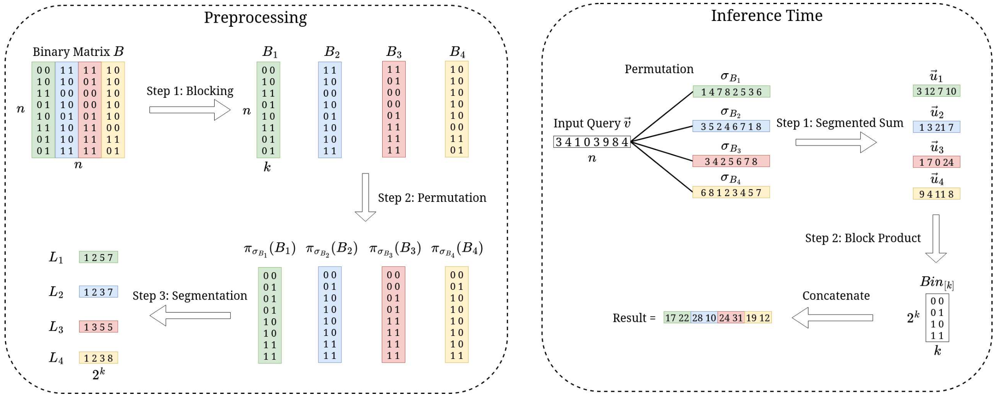

# 🔥 An Efficient Matrix Multiplication Algorithm for Accelerating Inference in Binary and Ternary Neural Networks

<!-- This repository contains code and experiments for the paper, [An Efficient Matrix Multiplication Algorithm for Accelerating Inference in Binary and Ternary Neural Networks](https://arxiv.org/abs/2411.06360).-->

<p align="center">
  
</p>

This repository implements **R**edundant **S**egment **R**eduction (RSR), a fast matrix multiplication algorithm designed for matrices in binary and ternary networks. The RSR method optimizes computation efficiency by a `log(n)` factor, making it particularly useful for applications in low-bit deep learning and efficient inference.

This code implements the following [published paper](https://arxiv.org/abs/2411.06360) at `ICML'25`:
```
@inproceedings{dehghankar2025efficient,
  title     = {An Efficient Matrix Multiplication Algorithm for Accelerating Inference in Binary and Ternary Neural Networks},
  author    = {Dehghankar, Mohsen and others},
  booktitle = {Proceedings of the 42nd International Conference on Machine Learning (ICML)},
  year      = {2025},
  archivePrefix = {arXiv},
  eprint    = {2411.06360},
  primaryClass = {cs.LG}
}
```

This repository includes:
- A native **C++** implementation of the RSR method for performance comparison.
- **NumPy**-based implementations for ease of experimentation and integration into Python workflows.
- **PyTorch** implementations with both CPU and GPU support, enabling scalable and optimized matrix operations in deep learning environments.
- **BitNet.cpp** integration of the RSR algorithm.

This project aims to provide a fast and efficient approach to low-bit matrix multiplication.

<p align="center">
    【🧠 <a href="#-llm-experiments">Large Languange Models</a> | 🧮 <a href="#-numpy-implementations">NumPy</a> | 🔥 <a href="#-torch-implementations">PyTorch</a> | 💻 <a href="#-native-c-implementations">C++</a> | 🚀 <a href="#-bitnetcpp">BitNet.cpp</a>】
</p>

<p align="center">
  
  <p align="center">A visualiazation of the algorithm.</p>
</p>

---

## 🧮 NumPy Implementations

The NumPy implementations of the matrix multipliers (`Naive`, `RSR`, and `RSR++`) are found in `numpy_impl` directory. You can use these multipliers by instantiating a `Multiplier` object and passing a weight matrix `A` (required) and an optional parameter `k`. Initialization automatically includes any necessary preprocessing steps, and you can perform inference on input vectors using the `multiply` method.

### ⚙️ Requirements
Ensure you have `Python >= 3.6` installed, along with all packages listed in `requirements.txt`.

### ✅ Testing the Multipliers
To validate the correctness of the `RSR` and `RSR++` multipliers, run `rsr_test.py`. This script randomly generates a weight matrix and an input vector, then compares the results of the multiplication with the ground truth. To run the tests use `./run_test.sh` inside `numpy_impl` directory.

---

## 💻 Native C++ Implementations

Native C++ implementations for the matrix multipliers are available in the `native` directory.

### ⚙️ Requirements
To compile and run the C++ code, you’ll need `clang++` installed.

### ⏱️ Run Time Comparison
To compare run times for different values of `n` across algorithms, use the script `./run_time_compare.sh [algorithm]`, where `[algorithm]` can be one of `naive`, `rsr`, or `rsrpp`.

### 🔧 `k` Optimization
To test various values of `k` for runtime optimization, run `./run_k_optimization.sh`. This script benchmarks the run times for different `k` values, with the target `n` value specified in `k_optimization.cpp`.

### 🧪 Running Tests
Several tests are provided to ensure algorithmic correctness. Run these tests by executing `./run_test.sh` inside `native` directory.

---

## 🔥 Torch Implementations
Torch implementations are inside `torch_impl` directory. This implementation works only with torch tensor operations. To run the tests and examples run `./run_tests.sh` inside `torch_impl` directory.

---
## 🧠 LLM Experiments
The LLM implementations are inside `llm` directory, which contains both codes for the inference on CPU and GPU in the corresponding dirs. The `patch_[cpu/gpu].py` file contains patched functions for preprocessing and the new `forward` function for the `BitLinear` module. 

- The notebook `[cpu/gpu]_impl/profile.ipynb` contains an example code to apply patch and profile the running time.
- Currently, this example works with this `1.58bit` models: [`Llama3-8B-1.58bit`](https://huggingface.co/HF1BitLLM/Llama3-8B-1.58-100B-tokens), [`Falcon3-10B-1.58bit`](https://huggingface.co/tiiuae/Falcon3-10B-Instruct-1.58bit), and [`Falcon3-3B-1.58bit`](https://huggingface.co/tiiuae/Falcon3-3B-Instruct-1.58bit).
- The notebook `gpu_impl/matrix_mult_compare.ipynb` contains the code for comparing the pure matrix multiplication of `torch` and `RSR`.
- The result of experiments on GPU is shown in the paper, **Experiments** section.

---
## 🚀 BitNet.cpp
A PoC comparison of `RSR` with [BitNet.cpp](https://github.com/microsoft/BitNet) is implemented in `bitnetcpp` directory. It integrates the `C++` implementation of `RSR` into the `BitNet.cpp` environment. 
- Check `bitnetcpp/README.md` for more details on building and running.
